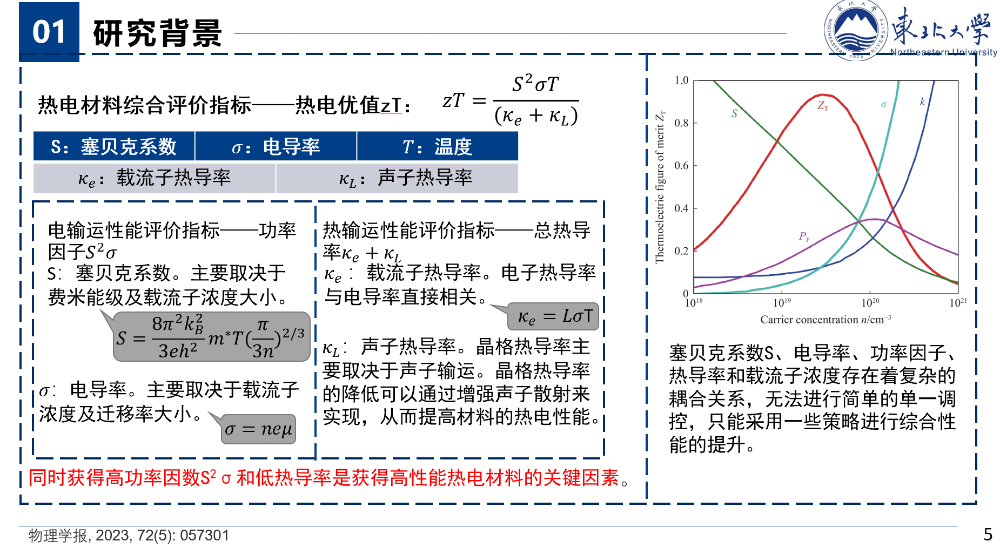

# 第 1 章	绪 论

## 1.1 能源

### 1.1.1 能源的分类

能源通常有以下六种分类方法：按能量来源分类、按被利用的程度分类、按获得的方法分类、按能否再生分类、按能源本身的性质分类和按对环境的污染情况分类。

（1）按能量来源分类：1.地球本身蕴育的能源 2.来自地球外天体的能源 3.来自地球和其他星体的相互作用。

（2）按被利用的程度分类：1.常规能源（传统能源） 2.新能源（非常规能源）

（3）按获得的方法分类：1.一次能源  2.二次能源

（4）按能否再生分类：1.可再生能源 2.不可再生能源

（5）按能源本身的性质分类：1.含能体能源（载体能源） 2.过程性能源

（6）按对环境的污染情况分类：1.清洁能源 2.非清洁能源

### 1.1.2 能源发展的现状

能源发展的第一个问题：**能源结构问题**。中国煤炭消费量的比例明显偏高，天然气与核能的比例明显偏低，与世界平均水平相差甚远。这种以煤炭为主的能源结构并不合理，不仅受制于煤炭资源和开采安全问题，而且不利于环境保护。

能源发展的第二个问题：**能源效率问题**。它是指终端用户使用能源得到的有效能源量与消耗的能源量之比。

能源发展的第三个问题：**能源环境的污染问题**。其中大气污染和水体污染会直接危害生态环境和人体健康。

能源发展的第四个问题：**能源安全问题**。它是指能源可靠的供应保障。

## 1.3 能量转换原理

### 1.3.1 能量的传输和储存

能量在空间上的转移和时间上的转移即为能量的传输和储存

### 1.3.2 能量转换装置的基本要求

在实现能量转换时，对转换装置的基本要求为：①转化效率要高。②转换速度要快。③具有良好的负载调节性能。④满足环境上和经济合理性的要求。

### 1.3.3 能量转换的基本原理

能量转换的基本原理主要有三个：热力学第一定律、热力学第二定理、卡诺循环

热力学第一定律：自然界一切物质都具有能量，能量既不能被创造，也不能被消灭，只能从一种形式转换为另一种形式，从一个物体传递到另一个物体；在能量转换与传递的过程中，能量总量恒定不变。

热力学第二定律：“不可能把热量从低温物体传到高温物体而不引起其他变换”/“不可能从单一热源吸取热量使之完全转变为功而不产生其他影响”

卡诺循环：卡诺循环描述的是一种理想热机循环过程。它描述的是工作温度分别为T1和T2的两个热源之间的正向循环（T1为高温热源，T2为低温热源），由两个可逆定温过程和两个可逆绝热过程组成，卡诺循环效率为ηc=1-T2/T1。

## 1.4 能量转换材料与技术（全书概述）

### 1.4.1 功能材料与能量转换材料的定义

功能材料：功能材料指的是除了具有机械特性歪，还具有其他功能特性的材料。

能量转换材料：利用能量转换效应制造具有特殊功能的元器件的材料称能量转化材料。

### 1.4.2 能量转换材料与技术的分类

#### 1.4.2.1 光电光热能量转换材料与技术

太阳能的利用方式：1.光电转换 2.光热转换

##### 光电转换

**光电转换**：基于**光电效应**实现光能到热能的转换。

**光电效应**：它是指在高于某特定频率的太阳光照射下，某些物质内部的电子会被光子激发出来而形成电流的现象。

**光电转换材料**：指利用光电效应将光转换成电能的材料。

主要应用：太阳能电池、光电管、光敏二极管、光敏电阻等。

光电能量转换材料分类：1.硅系太阳能电池材料（单晶硅太阳能电池材料，多晶硅太阳能电池材料） 2.薄膜太阳能电池材料 3.有机物薄膜太阳能电池材料 4.燃料敏化太阳能电池材料 5.钙钛矿太阳能电池材料

##### 光热转换

**光热转换**：利用集热装置将太阳能辐射收集起来，再通过与介质的相互作用转换成热能，进行直接的热利用或间接的太阳能光热发电。

主要应用：太阳能集热器、太阳能热泵、太阳能光热发电。

光热转换材料分类：集热材料、导热材料、储热材料、集热材料上的选择性吸收涂层。

#### 1.4.2.2 热电能量转换材料与技术

**热电效应**：在由不同导体构成的闭合电路中，若使其两结合部出现温度差，则在此闭合电路中将有电流流过，或产生电势，这种现象称为热电效应或温差电效应，具体有塞贝克（Seebeck）效应、帕尔帖（Peltier）效应和汤姆逊（Thomson）效应。

**热电材料**：指利用热电效应，将热能转换成电能或者将电能转换成热能的材料。

**分类**：（1）金属及合金热电材料。（2）半导体热电材料

#### 1.4.2.3 压电能量转换材料与技术

**压电材料**：压电材料可实现机械能和电能之间的相互转换，为机-电耦合的纽带，应用于机电换能方面。

**压电效应**：压电效应分为正压电效应和逆压电效应。

**正压电效应**：正压电效应指在极性晶体上施加压力、张力、切向力时，发生与应力成比例的介质极化，同时在晶体两端出现正负电荷。

**逆压电效应**：逆压电效应指在极性晶体上施加电场，引起极化，将产生与电场强度成比例的变形或机械应力。

**压电材料分类**：①压电单晶体。②压电陶瓷。③压电聚合物。④压电复合材料。⑤压电半导体。

**压电材料应具备的主要特性**：①转换性能，要求具有较高的压电常数。②机械性能，机械强度高、刚度大。③电性能，高电阻率和高介电常数。④环境适应性，温度和湿度稳定性要好，要求具有较高的居里温度，获得较宽的工作范围。⑤时间稳定性，要求压电性能不随时间变化。

#### 1.4.2.4 电致发光能量转换材料与技术

**电致发光**：有些物质受到外界电场的作用而发光，即将电能直接转换成光能，这种现象称为电致发光。

**电致发光材料**：具有这种将电能转换为光能能力的材料称为电致发光材料。

电致发光原理按工作电压可分为**低场电致发光**和高**场电致发光**。

**低场电致发光**：又称为注入式发光，主要是指半导体发光二极管（LED）

**高场电致发光**：又称为本征式发光，主要包括粉末型和薄膜型两种。

#### 1.4.2.5 化学能-电能能力转换材料与技术

化学能-电能能量转换材料主要应用于储能领域，储能就是在能量富余时利用特殊装置把能量储存起来，并在能量不足时释放出来，从而调节能量供求在时间和强度上的匹配性。

按照储存能量的形态，储能方式大致可分为如下四类：

（1）机械储能：以动能形式储存能量。

（2）蓄热：以物质内能的方式储存能量。

（3）化学储能：不同储能材料通过媒介发生化学反应，将电能、热能等能量存储在化学反应装置中。

（4）电磁储能：把能量保存在电场、磁场或交变等电磁场内。

材料要求：①合适的相变温度。②较大的相变潜热。③合适的热导率。④在相变过程中不应发生熔析现象。⑤必须在恒定的温度下熔化或固化，即必须是可逆相变。⑥无毒、对人体无腐蚀，环境友好。⑦不腐蚀容器，与容器材料相容。⑧不易燃。...

#### 1.4.2.6 磁能-机械能能量转换材料与技术

**磁能-机械能能量转换材料**：将磁能转换成机械能的材料。

**磁致伸缩材料**：磁能-机械能能量转换材料在换能器中具有重要应用，其在外磁场磁化过程中，自身长度和体积可以发生变化，又称为磁致伸缩材料。

#### 1.4.2.7 其他能量转换材料与技术

除了以上介绍的几种能量转化材料外，还有光催化材料、磁致冷材料等。

# 第2章	光电光热能量转换材料与技术

## 2.1 引言

**光电转换**：光电转换是利用光电效应，将太阳辐射能直接转换成电能，主要应用在太阳能电池领域。

**光热转换**：光热转换是太阳能的热利用，它是用集热装置将太阳辐射能收集起来，通过与介质的相互作用转换成热能，进行直接或间接的利用。

## 2.2 光电能量转换材料与技术

**光电能量转换原理**：光电能量转换的基本原理就是光电效应，它是指在高于某特定频率的电磁波照射下，某些物质内部的电子会被光子激发出来形成电流。光电效应分为**内光电效应**和**外光电效应**，内光电效应分为光电导效应和光生伏特效应。

### 2.2.1 内光电效应

**内光电效应**：光激发所产生的载流子（自由电子或空穴）仅在内部.运动，并未逸出形成光电子，这种光电效应就是内光电效应。

1）**光电导效应**

光电导效应：由于光照而引起半导体的电导率σ发生变化的现象称为光电导效应。如光敏电阻。

2）**光生伏特效应**

光生伏特效应：光生伏特效应是指半导体吸收光能，在p-n结区产生电动势的效应。

### 2.2.2 外光电效应

**外光电效应**：金属或半导体受光照射，如果光子能量足够打，可以使电子从表面逸出，此现象称为光电子发射效应。

### 2.2.3 特性参数

评价太阳能电池的特性参数主要包括p-n结的开路电压、短路电流、填充因子及电池的光电转换效率、温度系数。

**1）开路电压Voc**

在某特定的温度和辐射度下，太阳能电池在开路（R → ∞）状态下，此时I = 0，开路电压与光强和温度有关。

**2）短路电流Isc**

在某特定温度和辐射条件下，太阳能电池在短路（V=0）状态下，此时If = 0，输出电流与电池面积、光强和温度有关。

**3）填充因子F**

太阳能电池的最大功率与开路电压和短路电流乘积之比为填充因子。

**4）转换效率q**

转换效率指光照太阳能电池的最大功率与入射到该太阳能电池上的全部辐射功率的百分比。

**5）温度系数**

α：在规定的实验条件下，被测太阳能电池温度每变化1℃，太阳能电池短路电流的变化值。

β：太阳能电池开路电压的变化值。

### 2.2.4 光电材料的分类与制备

**光电材料分类**：根据所用材料可以将光电材料分为单晶硅太阳能电池，多晶硅太阳能电池，非晶硅薄膜太阳能电池，多晶硅薄膜太阳能电池，多元化合物薄膜太阳能电池（砷化镓，碲化镉，铜铟硒），有机物薄膜太阳能电磁，燃料敏化太阳能电磁和钙钛矿型太阳能电池。

**单晶硅电池片制备工艺流程**：单晶硅锭要经过一定的工艺流程制备成单晶体硅电池片，主要工艺步骤包括：切片，绒面制备，p-n结制备，刻蚀和去磷硅玻璃（PSG），镀减反射膜，铝背场制备，金属电极印刷，烧结。

(a)**绒面制备**：清洗制绒的主要目的是**清洗表面油污及金属杂质**，去除表面损伤层和形成表面织构化，减少光反射。绒面制备就是用择优腐蚀剂进行腐蚀制绒，如NaOH或KOH。

(b)**p-n结制备**：**扩散形成p-n结**是单晶硅太阳能电池生产最基本也是最关键的一步工艺。一般利用掺硼的p型硅作为基地材料，在900℃左右通过扩散五价的磷原子形成n型半导体。

(c)**刻蚀和去磷硅玻璃**：扩散过程中，在硅片的周边表面也形成了扩散层。扩散层会连通电池的上下电极形成短路环，使得电池并联，电阻下降，甚至成为废品，因此必须将它去除。**去边**的方法有干法刻蚀和湿法腐蚀。硅片在经过等离子体刻蚀后，**表面尚存在一层磷硅玻璃层**（PSG层，含磷二氧化硅），PSG层具有亲水性，易潮解，必须在等离子增强化学气相沉积（PECVD）镀膜之前去掉，去PSG在HF溶液中进行。

(d)**镀减反射膜**：为了**减少硅片表面的太阳光反射**，要在硅片表面增加一层减反射层。

(e)**金属电极印刷**：单晶硅太阳能电池经过制绒，扩散及等离子体化学气相沉积法镀膜等工艺过程后，p-n结已经形成，在光照下可以产生光电流。**为了将电流导出，需要在电池表面制作正，负电极**。制备单晶硅电池电极一般采用丝网印刷，它是通过压印的方式将预定的电极开关印刷在硅片上。它可分为三个步骤：正面银浆印刷，电池背面银铝浆印刷，电池背面铝背印刷。

(f)**烧结**：金属电极印刷后的电池片需要经高温烧结才能**形成电极欧姆接触和铝背场**，当银电极和晶体硅在温度达到共晶温度时，晶体硅原子以一定的比例融入熔融的银电极材料中，从而形成上下电极的欧姆接触。

### 2.2.5.**光电效应的主要应用**

a.**光电管**：利用**外光电效应**的基本光电转换器件。

b.**光电倍增管**：将**微弱光信号转换成电信号**的真空电子器件，它能在低能级光度学和光谱学方面测量波长200-1200nm的极微弱辐射。

c.**光电探测器**：由辐射引起被照射材料的**电导率发生改变**。

d.**电子能谱仪**：是利用**光电效应测出光电子的动能及其数量**的关系，由此来判断样品表面各种元素含量的仪器。

e.**光催化剂**：是在光子的激发下起到**催化作用**的化学物质，用于环境净化，自清洁材料，先进新能源，癌症治疗，高效率抗菌等多个前沿领域。

f.**光电池**：利用光电效应原理**直接将光能转换为电能**的装置，已被广泛用于光电发电，自动控制和测量装置。

h.**静电感应光电探测晶体管**：一个新型的固态光电探测器件，可用于微光探测，光子计数，射线与例子检测，在航天，遥感，天文及光通信方面有广泛的应用前景。

## 2.3 光热能量转换材料与技术

### 2.3.1 原理与特征参数

**光热能量转换基本原理**：利用集热装置将太阳辐射能收集起来，再通过与介质的相互作用转换成热能，进行直接的热利用或间接的太阳能光热发电。

**特征参数**：

（1）集热器效率η ：集热器传热工质在规定时段内输出的有用能量与规定的集热器面积和同一时段内入射到集热器上太阳辐照量的乘积之比。

（2）效率因子F：流体对外界的传热系数与吸热面对外界的传热系数之比。

### 2.3.2 分类

a.**集热材料**：集热材料是指能够选择性地吸收太阳能辐射且可以释放一定辐射能的材料。【包括金属（主要采用金属，如铜和铜铝复合材料）和非金属（玻璃）。】

b.**选择性吸收涂层**：选择性吸收涂层是涂覆在集热器表面的功能层，能提高太阳能的吸收效率，尽量减少消光材料本体对环境的热辐射损失。【根据吸收原理和涂层结构的不同，可以将选择性吸收涂层分成本征吸收涂层，干涉型吸收涂层，金属-电介质复合涂层和表面结构型吸收涂层。】

c.**导热材料**：将能聚集的热量传导至蓄热系统且在这个过程中不会大量损失热的材料称为导热材料。

d.**储热材料**：将热量或冷量储存起来，在需要的时候再将其释放出来，这样的材料就成为储热材料。

### 2.3.3 应用

太阳能光热能量转换技术的主要应用：太阳能热泵、太阳能集热器、太阳能光热发电、太阳能辐射检测、太阳能生物医疗等。

#### 2.3.3.1 太阳能热泵

**主要工作流程**：晴天时经膨胀阀节流后的低温低压制冷剂经太阳能集热器加热后流入蒸发器中，经过蒸发后的制冷剂在压缩机中形成高温高压的气体，与水进行对流换热，制冷剂经膨胀阀又流回蒸发器中，如此循环。

**分类**:按照结构和形式，太阳能热泵可分为传统串联式太阳能热泵系统、直接膨胀式太阳能热泵系统、并联式太阳能热泵系统和混合连接式太阳能热泵系统。

#### 2.3.3.2 太阳能集热器

**分类**：按集热器内是否有真空空间可以分为平板型太阳能集热器和真空管型太阳能集热器。

(1)**平板型太阳能集热器**

工作原理：平板型太阳能集热器是一种吸收太阳辐射能量并向工质传递热量的装置，它是一种特殊的热交换器，集热器中的工质与远距离的太阳进行热交换。

结构：平板型太阳能集热器主要由吸热板，透明盖板，隔热层和壳体等几部分组成。

吸热板：吸热板是平板型太阳能集热器内吸收太阳辐射能并向传热工质传递热量的部件，基本上是平板形状。

(2)**真空管型太阳能集热器**

分类：真空管型太阳能集热器就是将吸热体与透明盖层之间抽成真空的太阳能集热器。按吸热体材料种类，可分为两类：一类是玻璃吸热体真空管（或称为全玻璃真空管）；另一类是金属吸热体真空管（或称为玻璃-金属真空管）。

结构：全玻璃真空管由外玻璃管，内玻璃管，选择性吸收涂层，弹簧支架，消气装置等部件组成；金属吸热体真空管由热管，金属吸热板，玻璃管，金属封盖，弹簧支架，消气装置等组成。

工作原理：真空管型太阳能集热器的工作原理是采用内管的吸热涂层吸收太阳光，加热内管里的水，再与水箱或连箱进行交换，提高水温。

#### 2.3.3.3 太阳能光热发电

**分类**：聚光方式不同，太阳能光热发电主要分为塔式、槽式和碟式。

对比特点：塔式效率最高；槽式技术成熟、相对简单；

# 第3章	热电能量转换材料与技术

## 3.1 引言

热电材料：热电材料也称温差热电材料，是一种将热能与电能直接进行相互转换的功能材料。

特点：无传动部件、无污染、无噪声、可靠性高、寿命长、易于控制和维护。

## 3.2 热电能量转换原理及特征参数

### 3.2.1 热电能量转换基本原理

温差电效应是电流引起的热效应和温差引起的电效应的总称，主要包括塞贝克效应，帕尔帖效应和汤姆逊效应，这三个效应通过开尔文关系式联系在一起。温差电效应还伴随产生焦耳效应和傅里叶效应。

#### 3.2.1.1 塞贝克效应

塞贝克效应是一种热能转换为电能的现象。当两种不同材料A和材料B组成串联回路，当两个接点处1和2温度维持在不同温度（T1>T2）时，则在材料A的开路位置x和y之间就会产生电势差Uxy，可表示为Uxy=α（T1-T2）。【原理：载流子扩散+内建电场】

#### 3.2.1.2 帕尔帖效应

帕尔帖效应是塞贝克效应的反作用，可应用于热电制冷或加热。在A和B两种导体组成的回路中施加电流I，除了由电阻产生的焦耳热外，在接头1处发生吸热，2处发生放热，且发生吸热还是放热会因电流方向的改变而改变（电流进处吸热，出处放热）。【原理：电荷载体在不同材料中处于不同能级，高能级进入低能级，放热，低能级进入高能级，吸热】      假设接头处的吸（放）热速率为QP，则有QP=πABI

#### 3.2.1.3 汤姆逊效应

当存在温度梯度△T的均匀导体中通有电流I时，导体中除了产生和电阻有关的不可逆焦耳热外，还有可逆的热效应，即电流反向后吸（放）热会变为（放）吸热，吸(放)热速率QT为     QT=βI△T

#### 3.2.1.4 焦耳效应和傅里叶效应

在温差电效应应用时，还伴随产生了焦耳效应和傅里叶效应两种热效应。

焦耳效应：QJ=I2R。单位时间内由稳定电流产生的热量。

傅里叶效应：Qκ=κAdT/dx。单位时间内经过均匀介质沿某一方向传到的热量与垂直于这个方向的面积和该方向上温度梯度的乘积成正比。

### 3.2.2 特征参数

(1)塞贝克系数α

理想的热电材料必须具有高的塞贝克系数，这意味着很高的发电或制冷能力。

(2)电导率σ	σ=μne

(3)热导率κ	

(4)载流子浓度n

(5)热电优值zT。将塞贝克系数、电导率和热导率结合到一起评价热电材料的性能，定义为热电优值Z（单位K-1)

(6)转换效率。

# 第4章	压电能力转换材料与技术

## 4.1 引言

**导电材料**：以电荷长程迁移，即传导的方式对外电场做出响应，这类材料称为导电材料。

**介电材料**：以感应的方式传递外电场的作用和影响，即沿电场方向产生电偶极矩或电偶极矩的改变，这类材料称为介电材料。

**压电材料**：对某些介电材料施加机械力时，就会引起其内部的正负电荷中心不再重合而产生电的极化，从而导致介质两个表面上出现符号相反的束缚电荷，并且其电荷密度与外力成正比，这种现象称为压电效应。具有压电效应的物质称为压电材料。

## 4.2 压电原理

### 4.2.1 压电效应

压电效应是一种机电耦合的效应，可以分为正压电效应和逆压电效应。

**正压电效应**：对于非对称中心结构的晶体，对其在一定方向上施加机械应力时，晶胞中正负离子的相对位移使正负电荷中心不再重合，导致晶体发生宏观极化，使得晶体两端面会出现数量相等，符号相反的束缚电荷，而且在一定范围内电荷密度与作用力成正比，这种由 “压力” 产生 “电” 的现象称为正压电效应。

**逆压电效应**：反之，若在此类晶体上施加电场，电场导致介质内部正负电荷中心位移，造成介质发生形变，在一定范围内，其形变与电场强度成正比，这种由“电”产生“机械形变”的现象就是逆压电效应。

### 4.2.2 特征参数

#### 4.2.2.1 压电常数

压电常数：表示压电晶体介电特性与弹性性质之间存在的线性耦合关系的物理量，它主要包括压电应变常数d，压电应力常数e，压电电压常数g和压电劲度常数h。

压电常数越大，压电性能越好。

#### 4.2.2.2 介电常数

介电常数：介电常数是在电场作用下，电介质的电位移D随电场强度E变化的参数，用ε表示，单位为F/m。

#### 4.2.2.3 弹性常数

弹性常数：弹性常数是反映弹性体的变形与作用力之间关系的参数。

#### 4.2.2.4 介质损耗

介质损耗：介质损耗是包括压电材料在内的任何介质材料所具有的重要品质指标之一。如介质漏电。

介质损耗越大，材料性能越差。

#### 4.2.2.5 机械品质因数

**机械品质因数**：压电体做谐振振动时，要克服内部的机械摩擦损耗（内耗），在有负载时还要克服外部负载的损耗，与这些机械损耗相联系的是机械品质因数Qm，它反映压电材料做谐振振动时，因克服摩擦而损耗能量的多少。

#### 4.2.2.6 机电耦合系数

**机械耦合系数**：机械耦合系数K是表示压电材料机械能和电能耦合程度的参数，是衡量材料压电性能强弱的重要物理量。

#### 4.2.2.7 频率常数

**频率常数**：当材料在外加电场的作用下，因外加电场的频率不同时，压电材料会产生不同的振动频率。

#### 4.2.2.8 居里温度

**居里温度**：磁性材料中自发磁化强度降到0时的温度。

居里温度是铁磁性或亚铁磁性物质转变成顺磁性物质的临界点。当T > 居里温度，物质变为顺磁体。

## 4.3 压电材料的分类

压电材料可以分为：压电晶体、压电陶瓷、压电聚合物、压电复合材料、压电半导体五类。

# 第5章 电致发光能力转换材料与技术

## 5.2 电致发光原理与特征参数

**电致发光**：电能直接转换成光能的现象为电致发光。

### 5.2.1 电致发光原理

#### 5.2.1.1 低场电致发光原理

基本原理：载流子在电场作用下实现电子由n区到p区的转移，转移的电子在结区与空穴发生复合而发光。

主要发光器件：LED。它能够把电能直接转换为光能。（导电）

LED发光原理：LED的关键部分是p-n结组成的发光层材料（带隙在可见光范围内），当LED两侧有电流通过时，**空穴**和**电子**被推向结区并在其中复合发光。

#### 5.2.1.2 高场电致发光原理

基本原理：过热电子和晶格原子发生碰撞，使晶格原子（可以是杂质原子）离化产生新的电子-空穴对，其中电子跃迁到导带，在价带中留下一个空穴。这些电子从激发态跃迁回到能量较低的基态，就会产生各自辐射复合发光。

主要发光器件：粉末电致发光器件和薄膜电致发光器件（不导电）

### 5.2.2 特征参数（LED电致发光）

#### 5.2.2.1 LED电学特性

I-V特性是LED芯片性能的主要参数。LED的I-V特性具有单向导电性、非线性性质，当外加正偏压时，表现为低接触电阻，反之为高接触电阻。

复习概念：正向死区 正向工作区 反向击穿区

#### 5.2.2.2 LED光学特性

包括:（1）光通量与流明效率（2）发光强度（3）亮度（4）照度（5）配光曲线（6）发光效率和视觉灵敏度（7）寿命（8）色温（9）显色性与显色指数

#### 5.2.2.3 LED热学特性

## 5.3 电致发光材料及制备

分类：高场电致发光材料可分为粉末型（无机）和薄膜型（无机）；低场电致发光材料可分为无极材料（LED）与有机材料（OLED）

### 5.3.1 高场电致发光材料制备方法

**溅射法**：薄膜的纯度高、致密性好

**真空蒸发法**：工艺简便、制备薄膜范围广

**溶胶凝胶法**：价格低廉、工艺简单、孔结构可控

**丝网印刷法**：成本低、见效快、承印物广泛

**脉冲激光沉积法**：简单,反应过程迅速

**喷雾分解法**：可实现大面积、大尺寸的沉积

**化学气相沉积法**：条件要求相对较高

**分子束外延法**：沉积薄膜质量高、能精确控制膜厚

## 5.4 电致发光能量转换技术与应用

主要应用：壁挂电视与电脑显示器、通讯终端与仪表显示、军事与航天领域、诱明OLED (TOLED)与柔软OLED (FOLED)

# 第6章 化学能-电能能量转换材料与技术

## 6.1 引言

化学电源按照是否可充放电划分为一次电池（原电池）与二次电池（蓄电池）

一次电池分类：锌碳电池、碱性电池、锂电池、碱性锌-空气电池

二次电池分类：铅酸电池、镍-镉电池、氢-镍电池、钠硫电池、锂离子电池

## 6.2 化学能-电能能量转换原理及特征参数

### 6.2.1 化学能-电能相互转换装置及原理

**可充电化学电源**：化学能与电能相互转换的典型装置

**电源基本组成**：正极、负极、电解质、隔膜等，能量转换核心材料多为正极材料和负极材料或催化剂。

**基本原理**：化学能与电能相互转换时，电源正负极发生化学反应，使正负极材料产生相变或元素发生化合价变化，同时伴随着离子和电子的定向迁移。

**分类**：按原理大致可将化学能与电能相互转换装置分为两类：离子迁移型、氧化还原反应型。

**离子迁移型**：离子迁移指离子的嵌入和脱嵌，例如锂离子电池的充放电过程。随着锂离子在正、负极之间往返嵌入/脱嵌来进行充放电。

### 6.2.2 化学能-电能单向转换装置及原理

化学能-电能单向转换装置即为由于电池反应本身不可逆或者可逆反应很难进行，化学能转换为电能后不能进行充电的化学电源装置。

包括锌碳干电池、碱性锌锰电池、锂电池、燃料电池等。下面以燃料电池为例介绍。

燃料电池：燃料电池是一种将燃料和氧化剂中的化学能直接转化为电能的单向能量转化装置，因而实际过程是氧化还原反应。

### 6.2.3 特征参数

**容量**：一定条件下电池能放出的电量

**电池内阻**：欧姆内阻、极化内阻

**电压**：开路电压、工作电压

**电压平台**：恒流充放电时电压平稳值

**充放电倍率**：充放电速度

**能量与功率**：电池对外做功

**自放电**：电极腐蚀等引起的容量衰减

**电池寿命**：额定容量下能够使用的时间

## 6.3 化学能-电能能量转换材料及制备

### 6.3.1 正极材料

#### 6.3.1.1 锂离子电池正极材料

特点：

（1）放电反应应具有较大的负吉布斯自由能变化，从而使电池的输出电压高；

（2）嵌入式化合物的分子量尽可逆小并且也许大量的锂可逆嵌入和脱嵌，以获得高的比容量；

（3）主体结构应具有较好的电子电导率和离子电导率，减少极化，可以大电流充放电，以获得高的功率密度；

（4）在锂的嵌入/脱嵌过程中，主体结构及其氧化还原电位随嵌/脱锂量的变化尽可能地小，以获得好的循环性能和平稳的输出电压平台。

（5）嵌入式化合物在整个电位范围内应具有很好的化学稳定性，不与电解质发生反应；

（6）环境友好、价格低廉、易于制备。

#### 6.3.1.2 锂离子正极材料分类及制备方法

##### 磷酸铁锂

**磷酸铁锂制备方法**：（1）固相合成法。（2）微波合成法。（3）溶胶-凝胶法。（4）水热合成法。 （5）溶剂热法。

**磷酸铁锂改性方式**：

（1）表面包覆。增强导电性、减小产物粒径。

（2）元素掺杂。提高电导率。具体有固相法、共沉淀法、碳热还原法等。

（3）提高比表面积。增大扩散界面面积，缩短Li+在颗粒内部的扩散粒径。

##### 二维层状结构正极材料

制备方法：共沉淀法、喷雾干燥法

##### 三维孔道/框架结构正极材料

**尖晶石锰酸锂合成方法**：固相反应法、熔融盐法、溶胶-凝胶法、聚合物前驱体Pechini法等以及液相制备前驱体后高温锻造法。

#### 6.3.1.3 钠离子电池正极材料

1）层状结构氧化物：NaMO2（M=Ni、Mn、Cr、Co、V等）

2）磷酸盐

3）钠离子快导体类——NaxM2（PO4)3

共沉淀-高温烧结法制备

#### 6.3.1.4 锂硫电池正极材料

##### 碳/硫复合正极材料

##### 导电聚合物/硫复合正极材料

##### 无机物/硫复合正极材料

#### 6.3.1.5 铅酸电池正极材料

### 6.3.2 负极材料

#### 6.3.2.1 锂离子负极材料

理想的锂离子负极材料应具有以下特点：

（1）氧化还原电位尽可能低，提高电池输出电压

（2）插入/脱插出锂的过程可逆，储锂量高

（3）插入/脱插出锂的过程体积变化小、结构稳定性好。

（4）氧化还原反应电位不随循环次数变化，保持稳定的充放电平台。

（5）具有较好的电导率和离子迁移率，减少电极极化并增强电池的倍率性能。

（6）电极材料表面结构良好，能与电解质形成良好、稳定的固态电解质界面。

（7）在充放电电压范围内，化学稳定性良好

（8）资源丰富，成本低廉，环境友好。

提高负极材料性能的方法：

①纳米化。提高比表面积和表面能，有利于电池容量、倍率及循环性能的提高。

②与碳或其他材料复合。例如与碳材料复合可增强电极材料的导电性同时缓解反应时的体积膨胀。

③构建特殊电极结构。例如三维大孔结构可具有更大的比表面积，提高材料与电解液的接触面积。

④元素掺杂。改变材料自身的结构缺陷，从而提高材料的离子或电子迁移率。

##### 6.3.2.1.1 碳负极材料

碳材料包括石墨类碳材料、无定形碳材料和碳纳米管等。

##### 6.3.2.1.2 合金类负极材料

###### 硅基材料

制备方法：静电纺丝法、球磨法、镁热还原法、模板法等。

###### 锡基材料

###### 金属氧化物

#### 6.3.2.2 钠离子电池负极材料

##### 6.3.2.2.1 碳材料

##### 6.3.2.2.2 锡基材料

##### 6.3.2.2.3 氧化物和硫化物

##### 6.3.2.2.4 磷及磷化物

#### 6.3.3.3 铅酸电池负极材料

铅酸电磁负极材料为**泡沫铅**

制备方法：铸造法、电沉积法、粉末冶金法等。

### 6.3.3 超级电容器电极材料

#### 6.3.3.1 碳材料

主要包括活性炭、活性碳钎维、碳气凝胶、碳纳米管、石墨烯。

#### 6.3.3.2 金属氧化物

主要包括二氧化锰以及镍、钴氧化物/氢氧化物

#### 6.3.3.3 导电聚合物

### 6.3.4 燃料电池催化材料

#### 6.3.4.1 AFC

阳极：Pt或朗尼镍

阴极：Pt/Ag

一般采用KOH作为电解质

#### 6.3.4.2 PEMFC

阳极：Pt/C

阴极：Pt/C

特点：质子交换膜（PEM）

#### 6.3.4.3 PAFC

阳极：Pt或合金

阴极：碳、Pt/C

#### 6.3.4.4 MCFC

阳极：多孔Ni电极

阴极：Ni/NiO

#### 6.3.4.5 SOFC

阳极：Ni/ZrO2

阴极：Sr/LaMnO3

## 6.4 化学能-电能能量转换技术与应用

### 6.4.1 锂离子电池

**特点**：

（1）电容大

（2）荷电保持能力强，自放电小

（3）安全性能高，适应快速充放电。

（4）循环寿命场。

（5）对环境友好。锂离子电池不含重金属，因此不会引发环境的恶化。

（6）无记忆效应

（7）体积小，质量轻，比容量高。金属锂半径小，质量最轻而且比能量密度高，这是其他电池无法相比的。

**缺点**：

（1）电池内部阻抗高。

（2）工作电压变化较大。

（3）成本高

（4）必须有特殊的保护电路

（5）与普通电池兼容差

**分类**：锂离子电池依据外形特点可以分为扣式、圆柱状、方形、软包型和电池组等不同类型。

**应用**：（1）电子产品。（2）交通工具。（3）国防军事。（4）航空航天。（5）储能。

### 6.4.2 铅酸电池

特点：

（1）安全密封

（2）泄气系统。

（3）维护简单

（4）使用寿命长。

（5）质量稳定、可靠性高。采用先进的生产工艺和严格的质量控制系统，铅酸电池的质量稳定、性能可靠。

### 6.4.3 燃料电池

特点：

（1）发电效率高

（2）环境污染小

（3）比能量高

（4）噪声低

（5）燃料范围广

（6）负荷调节灵活，可靠性高

（7）易于建设

### 6.4.4 电化学电容器

**超级电容器的特点**：

（1）充电速度快。

（2）循环使用寿命长

（3）大电流放电能力强，能力转换效率高。

（4）功率密度高

（5）产品原材料构成、生产、使用、储存及拆解过程均没有污染，绿色环保。

（6）充放电线路简单。

（7）超低温特性好

（8）检测方便

（9）容量范围通常为0.1~1000F

**超级电容器称之为超级电容器的原因**：庞大的表面积再加上非常小的电荷分离距离使得超级电容器较传统电容器而言有大得惊人的静电容量，这是其”超级“所在。

**应用**：①汽车领域②其他领域：照相机、音频设备和间歇性用电的辅助设施。

# 第7章 磁能-机械能能力转换材料与技术

## 7.1 引言

磁能-机械能能力转换材料：可以再外磁场的驱动下降磁能直接转换为机械能，也可以在力（矩）的驱动下将机械能转换为磁能的一种材料。

目前，主要利用磁滞伸缩材料来实现磁能同机械能之间的变换。

磁滞伸缩材料在外磁场的作用下可以发生不同程度的变形，反之，材料的变形也可以引起外磁场的改变，进而实现磁能同机械能之间的转换。

## 7.2 磁致伸缩原理及特征参数

### 7.2.1 磁致伸缩原理

磁致伸缩效应：磁致伸缩效应又称焦耳磁致伸缩效应，是指物质在外磁场的作用下，其尺寸在长度或体积上发生变化，而去掉外磁场后，又恢复到原来尺寸的一种现象。

#### 7.2.1.1 温度诱发的磁致伸缩

该机制基于居里温度（顺磁性与铁磁性转变温度）

当温度T大于居里温度TC时，铁磁体呈顺磁性，原子热运动引起的热能较大，晶体内相邻原子呈无序排列。

当温度等于或小于居里温度时，铁磁体转变为铁磁性，若交换积分与d/rn的关系处在曲线上升阶段，则原子间距增大，使得晶体膨胀。反之若交换积分与d/rn的关系处在曲线下降阶段，铁磁体会发生体积收缩。

#### 7.2.1.2 磁场诱发的磁致伸缩

在外磁场作用下多畴铁磁材料的磁畴要发生**畴壁移动**和**磁畴移动**，结果导致材料尺寸发生变化。

### 7.2.2 磁致伸缩材料的其他效应

维拉里效应：这是指磁致伸缩材料在外部施加的单向应力下引起自身磁化强度发生改变的现象。

魏德曼效应：在管状磁致伸缩材料的轴向同时施加电流和磁场，电流感生出的环形磁场同外加轴向磁场相互作用产生扭转磁场，材料在扭转磁场的作用下沿周向发生扭曲的现象。

麦修茨效应：当对管状磁致伸缩材料施加周向扭转力矩时，材料的磁化强度在沿扭转力矩的方向上出现变化的现象。该现象是魏德曼效应的逆效应。

ΔE效应：这是指磁致伸缩材料的弹性模量E随磁场改变而改变的现象。

跳跃效应：当磁致伸缩材料在磁化过程中又外部施加的预应力时，磁致伸缩系数呈跳跃式变化，磁化率也发生变化的现象。

### 7.2.3 特征参数

#### 7.2.3.1 磁致伸缩系数

##### 磁致伸缩系数的概念

材料的磁致伸缩可分为线磁致伸缩和体磁致伸缩。

线磁致伸缩：磁化过程中，材料在单一方向上伸长或缩短，称为线磁致伸缩；在体积上发生膨胀或收缩，称为体磁致伸缩。

##### 磁致伸缩系数的测量方法

###### （1）**电阻应变法**

电阻应变法是一种将磁致伸缩引起的相对形变通过应变片转化为电阻的方法。

###### （2）电容法

电容法是将样品的磁致伸缩转换为电容器两版之间的距离变化的测量技术，它通常用于测量小尺寸样品及薄膜材料的磁致伸缩系数。

###### （3）悬臂梁法

悬臂梁法通常用来测量薄片状或细丝状材料的磁致伸缩系数。

#### 7.2.3.2 动态磁致伸缩系数

动态磁致伸缩系数又称压磁系数，是指在交变磁场的作用下磁致伸缩材料产生的交变应变驱动磁场的磁场强度的比值。

#### 7.2.3.3 增量磁导率

对材料低频完整磁化过程中叠加一个高频交流磁化场，交流分量的磁导率即为增量磁导率。

#### 7.2.3.4 柔顺系数的测量

弹性体在单位应力下所发生的应变即为柔顺系数（SH33),柔顺系数为杨氏模量的导数，可以通过测量样品的轴向共振频率测得。

#### 7.2.3.5 磁机械耦合系数

磁机械耦合系数：磁滞伸缩材料的输出机械能与输入机械能的比值。

制备方法：①三参数法。②共振法

### 7.3.1 稀土金属及其合金

#### 7.3.1.1 稀土金属

稀土金属特别是重稀土金属在低于居里温度呈铁磁性状态时表现出极高的磁致伸缩效应。

#### 7.3.1.2 稀土合金

不同稀土元素在磁致伸缩系数和磁晶各向异性上又正负之分。如果两种稀土元素在固态下可以互溶形成连续固溶体，合理组合稀土元素使形成的稀土合金在磁晶各向异性上起到互相抵消的效果。

### 7.3.2 稀土-过渡金属间化合物

由于稀土金属及其合金的居里温度低而无法在室温下工作，研究者尝试将稀土金属同过渡金属结合形成化合物，在保留稀土金属或合金高磁致伸缩系数的前提下，提高材料的居里温度。

#### 7.3.2.1 晶体结构

Laves相化合物：RFe2型稀土-铁二元金属间化合物由一个稀土原子和两个铁原子构成，如TbFe2、DyFe2、SmFe2。这类金属间化合物属于Laves相化合物。

在Laves相化合物重，沿着晶体<111>方向的磁致伸缩量最大。

#### 7.3.2.2 磁致伸缩性能

从实际应用的角度来说，磁致伸缩材料应该具有高磁致伸缩系数、高居里温度、低磁晶各向异性和高饱和磁化强度。

#### 7.3.2.3 合金元素对Tb-Dy-Fe合金磁致伸缩性能的影响

元素替代改性可能是一种优化稀土铁基合金磁致伸缩性能的方法，但对合金磁致伸缩性能的提高有限，暂时还没有发现可以同时大幅提高稀土铁基合金居里温度和磁致伸缩性能的替代元素。

#### 7.3.2.4 材料的制备方法

稀土铁磁致伸缩材料主要采用定向凝固方法制备，如**布里奇曼法**、**区域熔炼法**和**丘克拉斯基法**。

##### 布里奇曼法

布里奇曼法，又称坩埚下降法，是一种常用的从熔体中生长晶体的方法。

基本原理：将欲生长的材料加入坩埚内，用电阻加热或者感应加热的方法将材料融化后保持稳定恒定，使盛装熔体的坩埚在结晶炉中下降，当通过温度梯度较大的区域时，坩埚底部的温度先下降到材料的熔点以下，并开始结晶，随后晶体随坩埚下降而自下而上持续结晶为整块晶体。

##### 区域熔炼法

区域熔炼法又称浮区法。

基本原理：先将预生长的晶体制备呈母合金棒料，将棒料用两个卡盘固定并垂直安放在保温腔体内。利用盘式感应线圈加热棒料的局部，形成宽度为8-10mm的熔区，熔区依靠熔体表面张力和电磁浮力维持柱状而不下塌，接下来使熔区从一侧逐渐移至另一端以完成定向结晶过程。

##### 丘克拉斯基法

丘克拉基斯法又称直拉法、提拉法。

基本原理：将欲生长的材料放入坩埚中，加热熔化并保持温度恒定，坩埚上方有一根能够旋转和升降的提拉杆，提拉杆内部可通入冷却水，产生单向冷却条件，提拉法的下端有夹持装置，上面装有籽晶，调整提拉杆的高度，使籽晶和熔体接触，在适当温度下，籽晶不会熔化也不长大，然后按所需提拉速度向上提拉和转动提拉杆，晶体就会以籽晶为晶核，慢慢定向凝固生长。

##### 粉末冶金法

##### 强磁场诱导凝固法

##### 热处理

对定向凝固制备的Tb-Dy-Fe磁致伸缩材料通常还需进行热处理。

# 第8章 其他能量转换材料与技术

## 8.1 光能-化学能能力转换材料与技术

### 8.1.1 概念

光催化过程：光催化过程一般采用半导体材料作为催化剂，在太阳光的照射下，价带电子会被激发到导带上，从而产生光生电子-空穴对，这些电子-空穴对迁移到光催化材料表面后产生活性自由基，它们能使污染物氧化分解。

光催化剂：光催化剂是一种在光的照射下，自身不起变化，却可以促使与之接触的物质发生化学反应的材料。

### 8.1.2 特征参数

量子效率（φ）是用于表征光催化剂活性的重要参数，它描述光化学反应中光子的利用程度。

即在给定波长下，消耗反应物的分子数或者产物的分子数与光催化剂吸收的给定波长的光子数之比，可表示为φ=Nm/Nhv

### 8.1.3 光能-化学能能量转换材料

#### 8.1.3.1 二元氧化物

包括TiO2和其他二元氧化物

实现TiO2可见光催化和提高光催化活性的主要方法：

（1）表面光敏化

（2）离子掺杂

（3）贵金属沉积

（4）复合半导体

#### 8.1.3.2 硫化物

#### 8.1.3.3 有机光催化材料

## 8.2 磁能-热能能量转换材料与技术

### 8.2.1 概念

磁热效应：又称磁卡效应，是指磁性材料在磁场增强或减弱时伴随放热或吸热的物理现象。

### 8.2.2 原理及特征参数

磁热效应的本质（基本原理）：磁热效应的本质是在磁场作用下磁性材料有虚度的改变，即磁熵变。

## 8.3 相变能-热能能量转换材料与技术

### 8.3.2 相变储能原理及特征参数

原理：物相转变时，即在相变过程中，将吸收或释放较大的被称为潜热的热能，并保持温度不变，把热（冷）能通过一定的方式储存起来，待需要时再把热（冷）能通过一定的方式释放出来。
